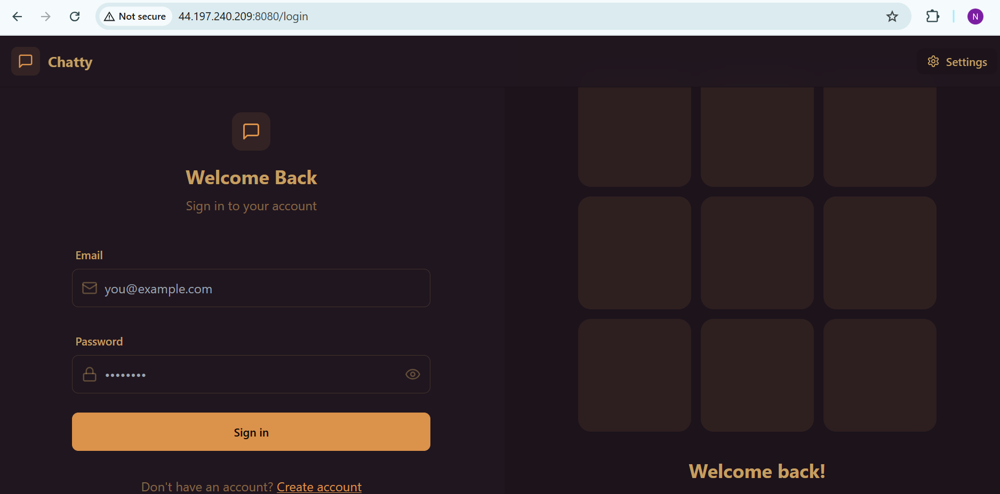

# ChatPulse Deployment Assignment

## Live Application

**URL:** http://44.197.240.209:8080

## Architecture

ChatPulse is a full-stack MERN chat application deployed on AWS EC2 using Docker.

- The React frontend is built and served using Nginx.
- The Node.js/Express backend runs in a separate Docker container.
- MongoDB runs in its own Docker container with persistent storage.
- Docker Compose manages the frontend, backend, and MongoDB services.
- The application is hosted on an Ubuntu EC2 instance.
- Docker images are pushed to Docker Hub through GitHub Actions.
- GitHub Actions automatically deploys the latest images to EC2 after every push to the main branch.
- An AWS S3 bucket is used to store a deployment artifact.
- IAM permissions and EC2 Security Groups are used to control AWS and network access.

## AWS Configuration

- **Service:** AWS EC2
- **Operating System:** Ubuntu
- **Frontend Port:** 8080
- **Backend Port:** 5001
- **MongoDB Port:** 27017
- **Deployment:** Docker Compose
- **CI/CD:** GitHub Actions
- **Container Registry:** Docker Hub
- **Storage:** Amazon S3

## Security

The EC2 Security Group allows the required application and SSH traffic. AWS credentials and application secrets are stored using GitHub Secrets and are not committed to the repository.

## Screenshot

